## Summit Overview

#### Attendee
##### Boston
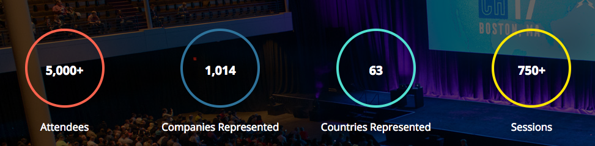 
##### Barcelona
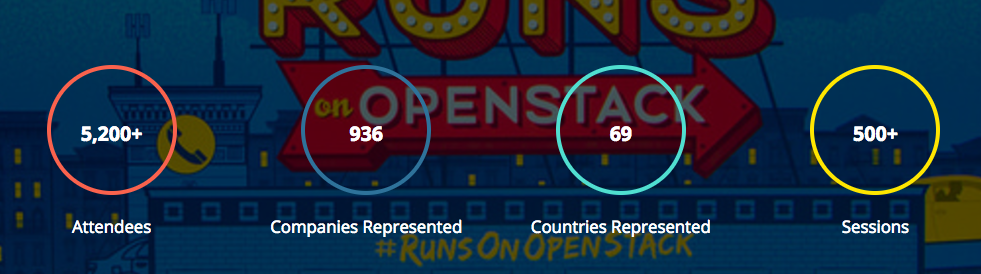 
##### Austin
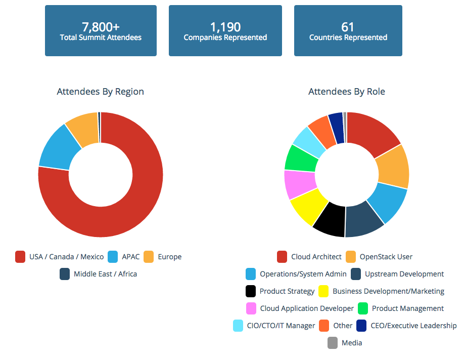 

#### PTG (Project Team Gathering) : Design Summit
* 년 2회 (1, 3분기)
* 기존 Conference 는 동일하게 2, 4분기에 진행
* 릴리즈를 기존 4월 10월에서, 2월, 9월로 변경
* 릴리즈 기간에 서밋을 진행하고, 이에 대한 피드백을 진행함
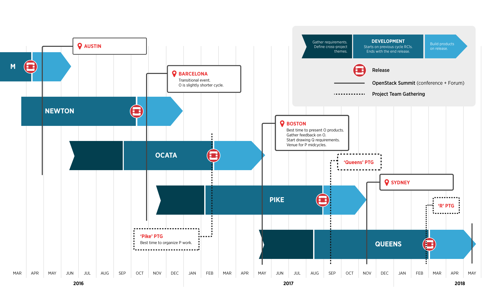
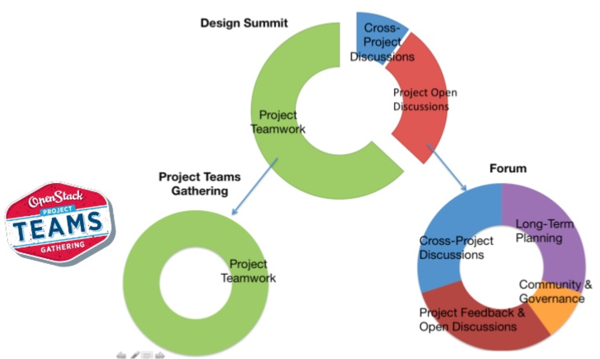

##### Pike PTG in Atlanta
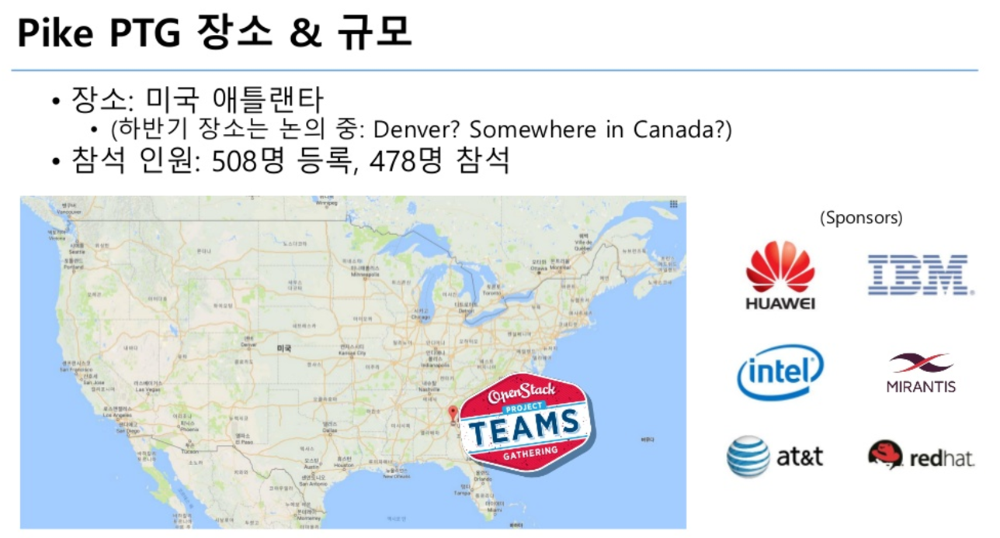
https://wiki.openstack.org/wiki/PTG/Pike/Etherpads

#### Schedule
##### Boston
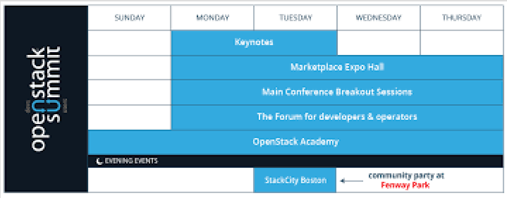
##### Sydney
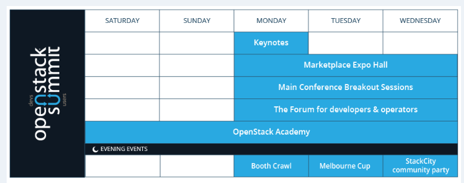
##### 상세
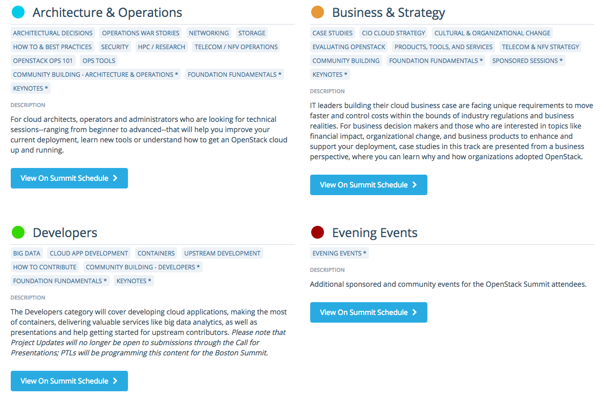
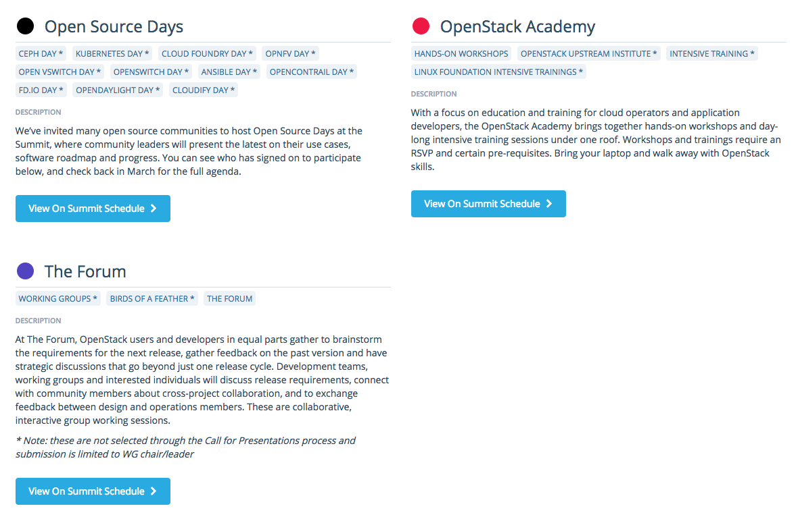

#### Venue : Hynes Convention Center / Sheraton Boston
* 매사츄세츄 보스턴에 위치한 컨벤션 센터임
* 컨벤션 센터에서는 키노트 및 기술세션이 주로 열렸으며
* Sheraton Boston 에서는 오픈소스데이 위주의 트레이닝 세션들이 열림

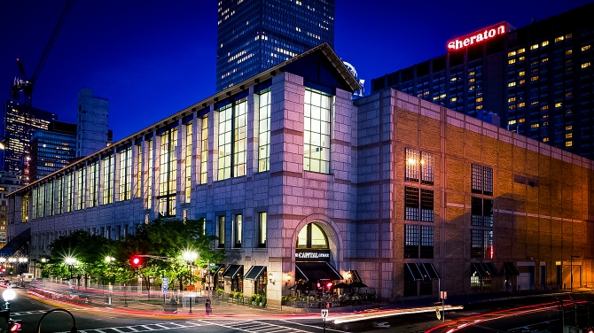 
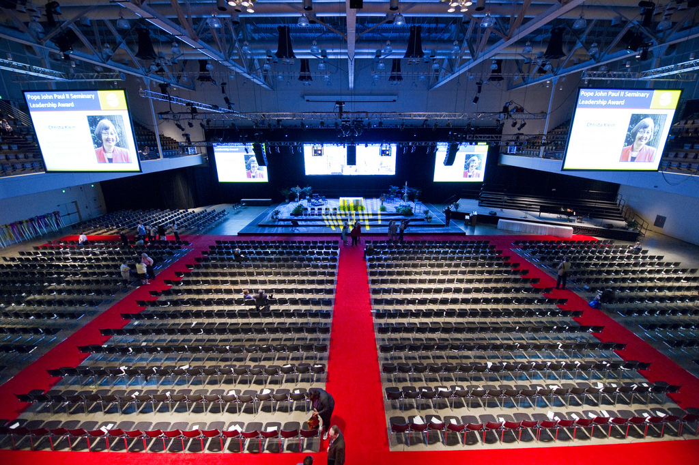 

#### 이번 서밋의 특징
##### OpenStack Academy
* User 및 운영자들을 위한 세션인 만큼 Training 에 대한 세션이 많아졌음
* OpenStack Certificate 에 대한 Trainging 을 위한 세션도 진행됨(토,일)
* OpenStack Upstream Institute
* Intensive Trainings
* Hands On Workshops
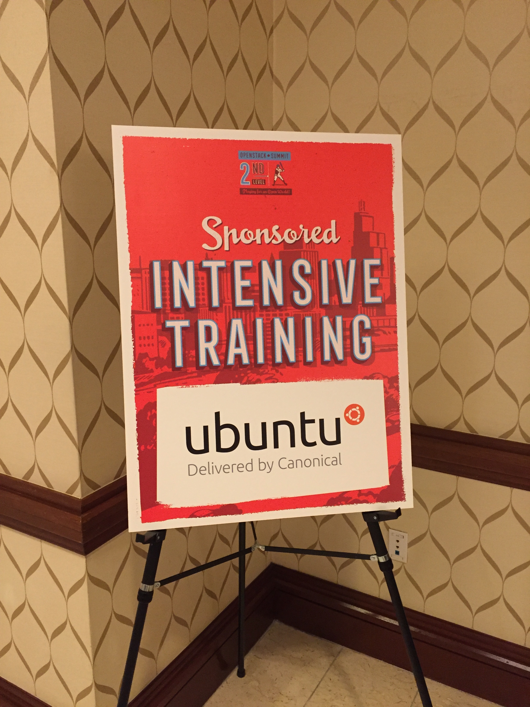
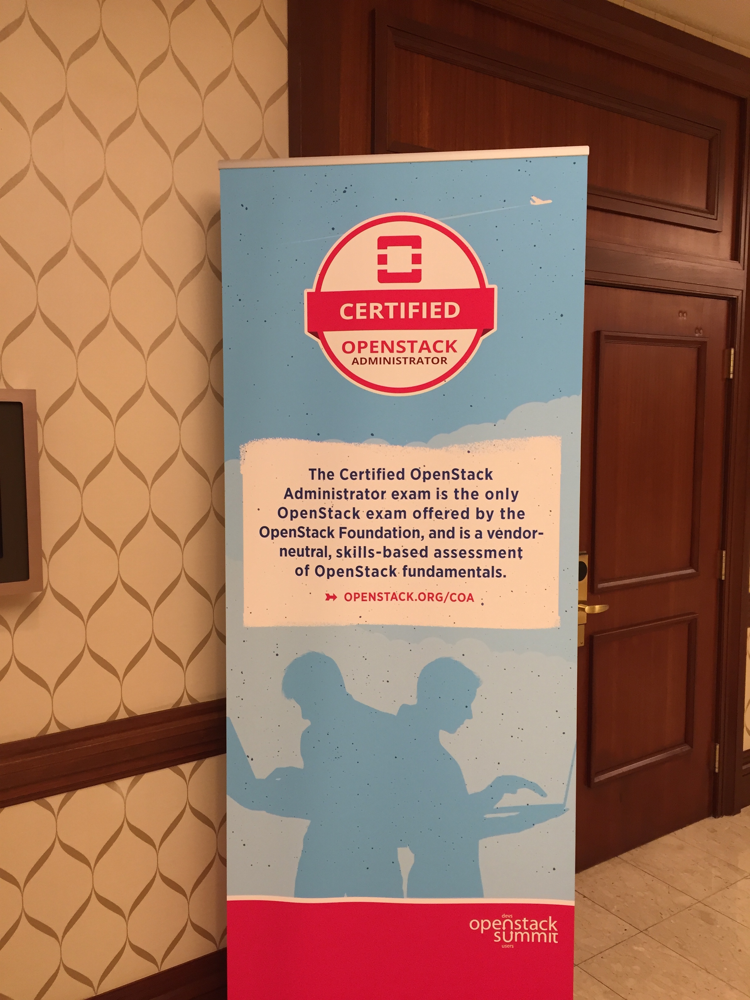

##### Forum / Feedback
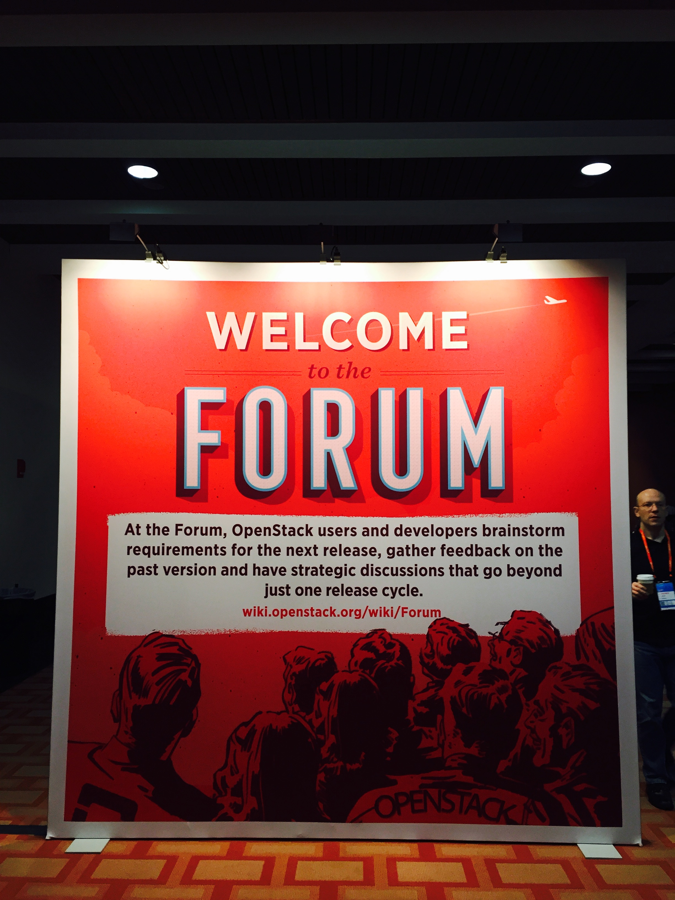
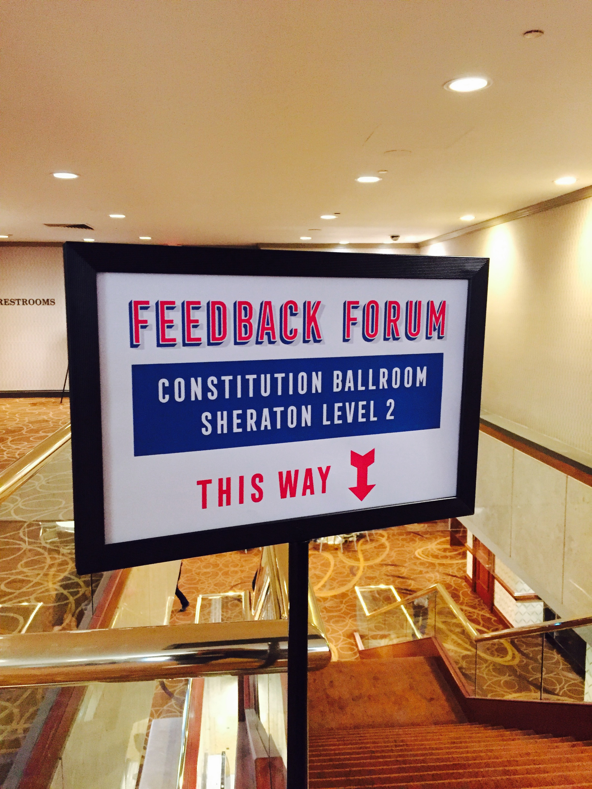

* 포럼은 새로 생긴 개발자와 사용자의 소통의 공간이다.
* 디자인 서밋의 분리로 인해 사용자의 피드백을 받을수 있는 별도 창구가 필요하였고, 포럼이 이를 대체한다.
  * 사용자 피드백
  * 전략 결정
  * On-Boarding 

##### Certified OpenStack Administrator 
* 오픈스택에 대한 자격증 시험에 대한 교육 및 시험을 치를수 있는 일정이 포함됨 
* 수요일 하루 2회에 걸쳐 자격증 시험을 진행함

#### Open Source Day
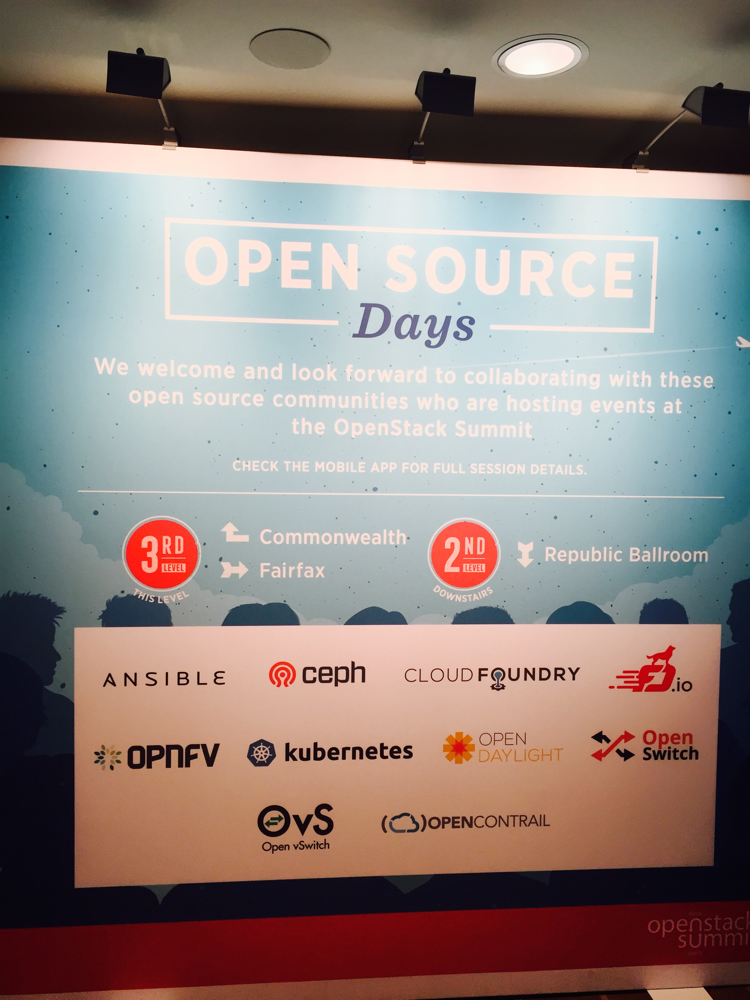
  * 오픈스택 자체 기술만을 공유하던 기존과는 달리 오픈소스와 함께하는 서밋([opensource day](https://www.openstack.org/summit/boston-2017/open-source-days/))으로 발전함
  * 아래 10개의 오픈소스 커뮤니티에서 별도 공간에서 다양한 주제들로 세션을 진행하였으며,
  * 대부분 101 세션(입문자)과 On-Boarding(컨트리뷰션), 운영관련으로 매일 다른 주제로 진행됨 
  * 오픈스택은 실제 내부적으로 다양한 오픈소스들의 결합으로 이루어져있고, 
  * 예전에는 대부분 해당 기술들을 사용하는 수준에서 그쳤으나,
  * 이제는 해당 커뮤니티와 적극적인 협업을 통해 서로 상생하는 방향으로 가는 단계로 보임 
  * 이는 키노트에서도 Jonathan 이 언급한 ``보다 많은 재단과 관련(adjacent communities) 커뮤니티와의 협업`` 관점과 의미를 같이하는 것으로 판단됨 
    * Open vSwitch Day
    * OpenContrail Day
    * FD.io Day
    * Kubernetes Day
    * Cloudify Day
    * Ansible Day
    * OPNFV Day
    * Cloud Foundry Day
    * OpenDaylight Day
    * Ceph Day

#### 디자인 서밋 분리
  * 오픈스택은 5월과 10월 1년에 두번 서밋을 진행하였습니다.
  * 하자만, 이번부터는 디자인 서밋을 분리하였고,(이는 개발자들이 개발에 대해서만 집중적으로 논의하고싶다는 의견때문에 분리됨)
  * 그로 인해 1년에 4번의 서밋이 진행되고 있습니다.(디자인서밋 2회, 오픈스택서밋 2)
  * 이미 올해초 500여명의 개발자들이 모여 디자인 서밋을 진행하였고,
  * 이번 서밋은 User 및 Operation 들을 위한 서밋으로 진행됨
  * 그대신 포럼이라는것을 신설하여 개발자와 사용자의 소통의 공간으로 활용함

#### Community Party : Fenway Park
  * 예전 서밋과 (제가 다녀왔던 포틀랜드:그리즐리서밋) 비교하면, 예전에는 네트워킹을 위한 자리가 많았으나,
  * 이번에는 Community Party 라고하여 하루만 행사를 진행하였음
  * 보스턴의 대성당이라고 불리는 역사와 전통을 간직한 메이져리그 구장을 통째로 빌려 파티를 진행함(단, 외야석만 입장가능)
  * 하지만, 날씨가 너무 추워서 대부분 버거만 먹고 돌아가는 바람에 네트워킹 행사는 의미 없이 끝남
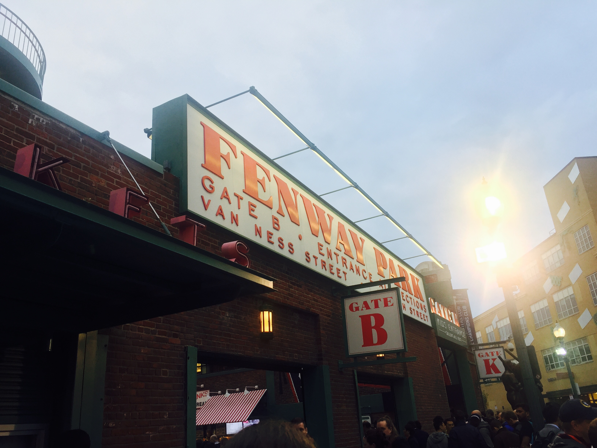

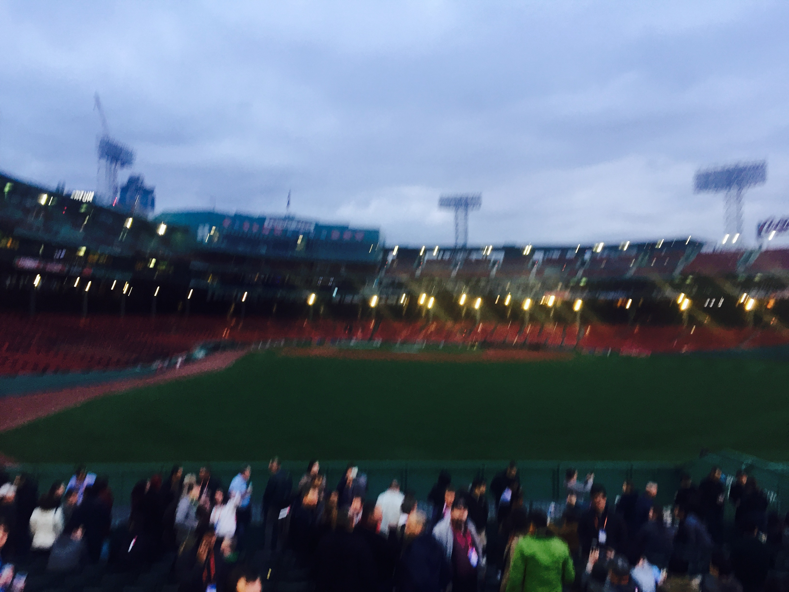

#### 한국인의 밤 행사
  * 매회 서밋을 방문한 한국인들과 네트워킹 행사를 가지고 있으며, 이번에도 관련 행사를 진행함
  * 대략 20여명 정도가 서밋에 참석한 것 같으며, 한국인의 밤 행사에는 16명정도 참석을함
  * 방문한 업체
    * 알토리서치(3) : SDN / NFV 개발업체이며, OVS 를 통한 Flow-Control 을 통해 SDN 구현 (스폰서 / 부스운영)
    * SKT(4) : All Flash Ceph 에 대한 튜닝 발표 및 OpenStack on k8s 를 주제로 발표진행함
    * 한국레드햇(1)
    * 숭실대(4) : 교수님 2 / 학생 2
    * 고려대(2) : 박사과정
    * OSC(Open Source Consulting)(2) : 오픈스택에 대한 유지보수 지원 
    * Zconverter(4) : 클라우드 마이그레이션 업체(스폰서 / 부스운영)
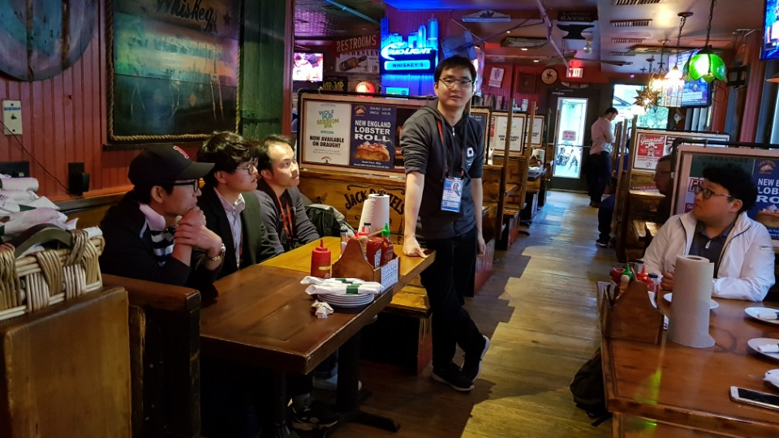
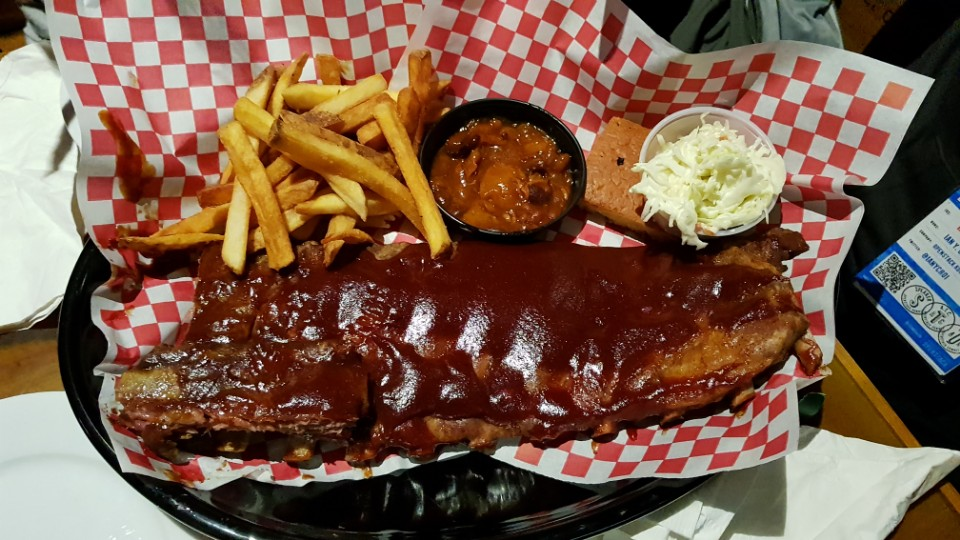

#### Market Place & Booth
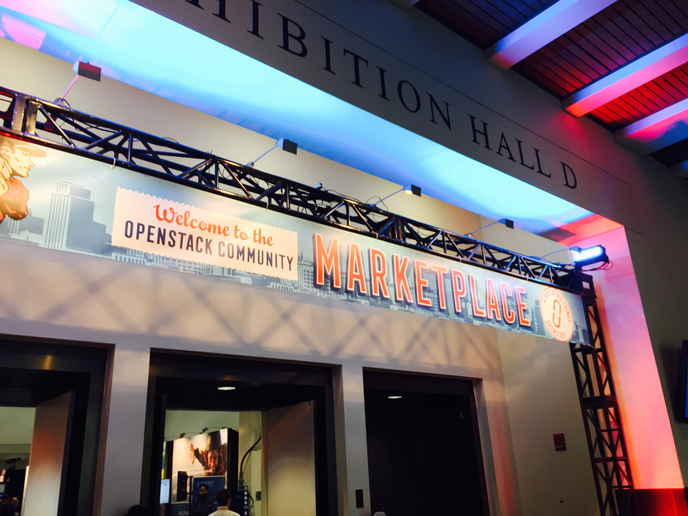
  * Zconverter
  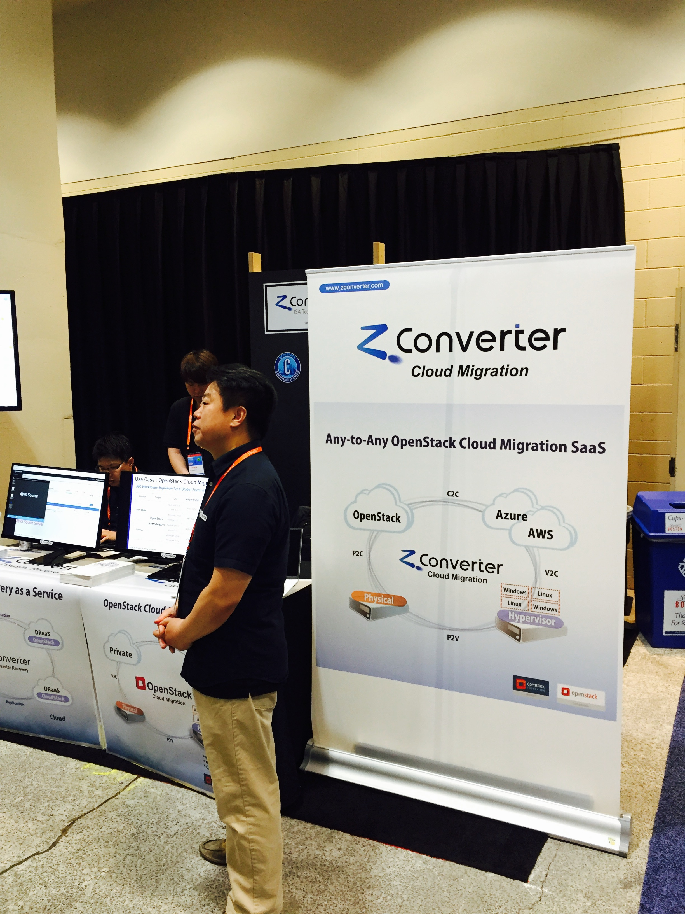
  * 알토리서치 
  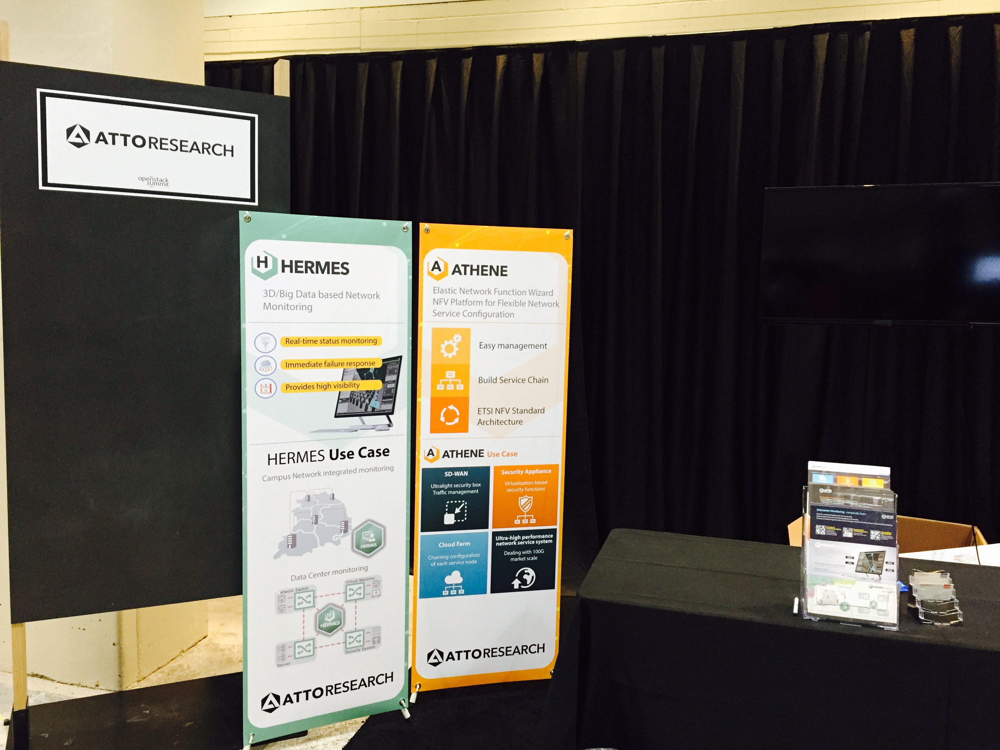

#### 한국인 발표
  * Make Both OpenStack and Kubernetes a Fail-Safe: a.k.a OpenStack on Kubernetes : SKT
  * Advanced Tuning and Operation Guide for Block Storage Using Ceph : SKT / Netmarble
  * What Makes it Possible to Run OpenStack Community for Three Generations : 한국오픈스택 커뮤니티
  * Participating in Translation Makes You an Internationalized OpenStacker and Developer : 최영락님
  * I18n-101: Introduction to Translation and Contributing Qualified Translation with Useful Tips : 최영락님
  * Feedback from Users for I18n & Translation - Important Part? : 최영락님

