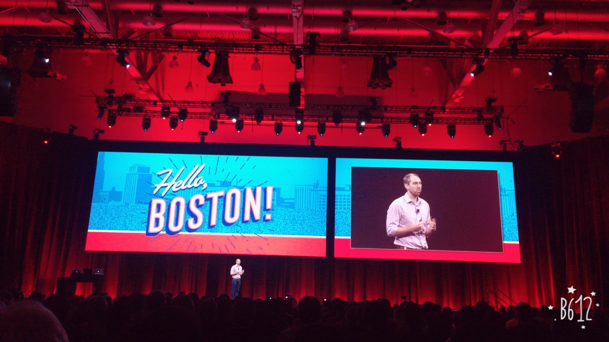
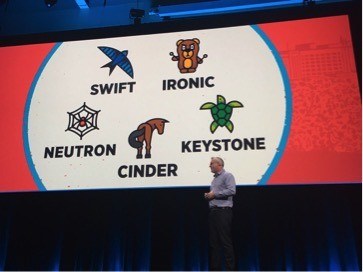
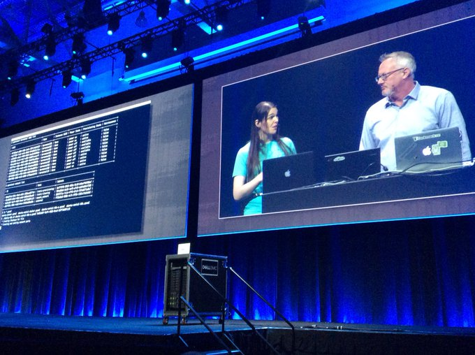
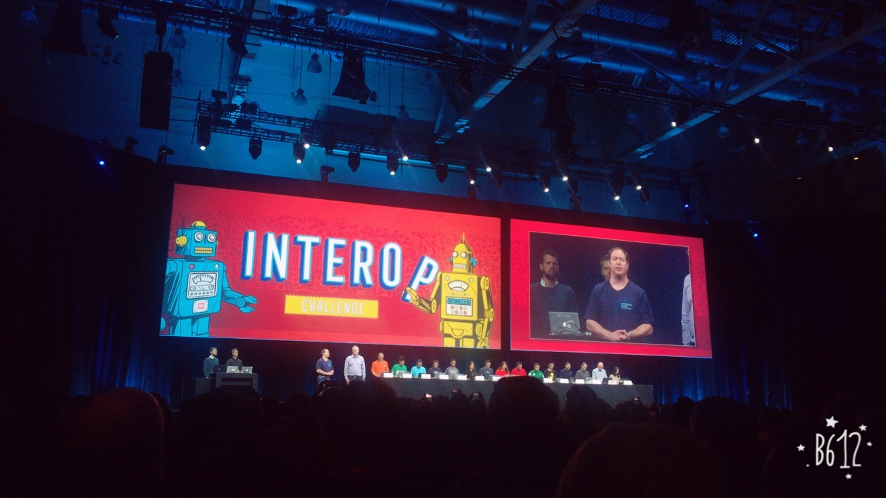
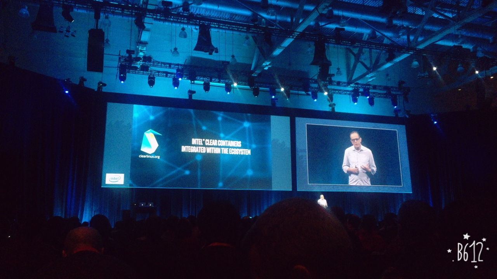

## Keynote 정리 

### 1일차

* Jonathan Bryce (executive director of OpenStack Foundation) 발표로 시작되었습니다.

* Jonathan 은 오픈스택은 지금 7년째이며, 500만 코어 이상이 Production 환경에서 동작중이라고 합니다.
* 배포수는 해마다 44 % 씩 증가하였으며, 배포수의 67%는 Production 으로 사용중이다.
* 또한 이런 오픈스택의 성장은 Private Cloud 의 성장과 밀접한 관련이 있다고 합니다.

* 첫날의 주 사용자의 사례발표가 진행되었습니다.
  * Verizon
  * AT&T 
  * eBay
  * U.S. Army Cyber School
  * GE Healthcare
    * "[Remotely Managed Private Cloud](https://www.openstack.org/marketplace/remotely-managed-private-clouds/)" 를 소개(Rackspace 와 협업) 
    * 이 모델이 주는 핵심 가치는 ``고객들은 본인의 Private Cloud 보유를 통한 이익을 가져갈 수 있으나, 운영에 대한 책임에서 완전히 자유로울 수 있다는것`` 입니다.)

#### Remotely Managed Private Cloud
* 불과 2 ~ 3 년전만해도 Deployment model 을 얘기할때 "On-Premise Distribution" 에 대한 얘기가 많이 나왔으나(사용자가 직접 구축함) 요즘은 많이 달라진듯 합니다.
* 그 이유가 오픈스택을 직접 구축하는것이 상당히 힘들 작업이며, 이를 수행할 전문인력을 구하기가 힘들고 그들의 몸값이 매우 비싼게 문제라고 합니다.
* 그래서 오픈스택 및 벤더들은 사용자가 좀 더 쉽게 오픈스택을 사용하고, 운영하기 위한 방안들을 강구하였고 현재 Market Place 에 나와있는 배포 모델은 아래와 같습니다.

##### 자체 HW 를 사용할 경우
* [Remotely Managed Private Cloud](https://www.openstack.org/marketplace/remotely-managed-private-clouds/)
  * 주요 내용은 오픈스택 전문인력을 직접 보유할 필요가 없으며, 원격으로 오픈스택 전문인력들이 당신의 Private Cloud 환경을 관리해주는 서비스이다.
  * 제공되는 서비스로는 모니터링, 월간 리포팅, 24x7x365 서비스, SLA 99.99% 보장 등 입니다.
  * 현재 Mirantis, EasyStack, IBM, CISCO, Rackspace, Ubuntu 등이 이 서비스를 제공중에 있습니다. 
* [DISTROS & APPLIANCES](https://www.openstack.org/marketplace/distros/)
  * Private Cloud 를 구축하기 위한 어려움을 전용 HW와 배포판을 통하여 쉽게 구축을 도와주는 플랫폼 서비스 입니다.
  * Redhat, VMWare, Oracle, Mirantis, HPE, CISCO, Ubuntu, DELL EMC, SUSE 등이 서비스를 제공하고 있습니다.

##### Hosting 을 할 경우
* [HOSTED PRIVATE CLOUD](https://www.openstack.org/marketplace/hosted-private-clouds/)
  * 만약 퍼블릭 클라우드 사용을 원하지 않고, 나만의 네트워크와 전용 서버 / 스토리지로 구성된 프라이빗 클라우드를 구축하고 싶을때 이용할 수 있는 서비스 입니다.
  * 직접 데이터 센터나 서버 구매를 할 필요가 없으며, 모든 것들을 전문 인력들이 그들의 데이터 센터에 쉽게 구축 및 운영을 제공해 주는 서비스 입니다.
  * 현재 Ubuntu, IBM Bluebox, Rackspace 등 여러업체가 서비스를 제공하고 있습니다.
* [PUBLIC CLOUD](https://www.openstack.org/marketplace/public-clouds/)
  * 오픈스택 기반으로 퍼블릭 클라우드 서비스를 제공받을 수 있으며, 웹사이트를 통하여 로그인 후 사용이 가능함(like Amazon Web Service)

#### 해결해야할 5가지 과제
* 이미 오픈스택은 기술적으로, 문화적으로 많이 성숙되어 있다. 하지만 아직도 많은 복잡성에 사로잡혀 있다. 이를 해결하기 위하여 재단에서는 많은 고민을 시작하고 있으며 크게 다섯가지 영역에서 고민하고자 한다.
  * 오픈스택이 무엇인가?(정확히 프로젝트에 있어야할 것이 무엇인지에 관해 살펴볼예정)
  * User 로 부터오는 Feedback loop 를 개선하고, 이러한 요구를 어떻게 Upstream 에 반영할지
  * 복잡성을 해결하기 위한 방안
    * 사용하지 않는 기능 제거
    * 불필요한 옵션값 제거
    * 불필요한프로젝트 제외
  * 보다 많은 재단과 관련(adjacent communities) 커뮤니티와의 협업
  * 새로운 커뮤니티 리더를 성장시키기 위한 계획

### 2일차 
* Mark Collier(COO OpenStack Foundation) 발표로 시작되었습니다.

#### Composable Infrastructure
* 오픈스택은 최초 2개의 프로젝트(nova/swift)에서 시작하였지만, 지금은 60개의 프로젝트로 커졌다.
* 하지만, 오픈스택을 사용하기 위해서는 연관된 프로젝트들을 모두 설치해야 사용될 수 있다.(monolithic cloud platform)
* 앞으로는 composable and programmable infrastructure building blocks 으로 원하는 기능만을 위해 조합하여 구성이 가능해야 한다.
* Swift 는 standalone 솔루션으로 배포와 사용이 가능하게 되었으며, Ironic / Cinder /Keystone / Neutron 등 사용이 가능할 것이다.

#### 데모
* 첫번째 데모는 Ironic / Neutron 으로 Baremetal Provisioning 을 진행함(DELL EMC)

* 두번째 데모는 Cinder 를 PM 에서 동작시켜, Storage 를 Container 의 Persistant Volume 으로 사용하기 위해 Host 에 할당하는 데모를 진행함(하지만 실패 ^^;;)

* 세번째 데모는 미란티스에서 빅데이터 Application 에 대한 데모를 진행하였음
  * Nova/Ironic/Contrail 를 통해 인프라를 구성하고, 
  * 그 위에 k8s 를 띄우고, 
  * Kafka / Spark / HDFS 를 통해 실시간 트위터 트렌드를 분석하는 데모를 진행함

* Global Scale 의 서비스를 시연하기 위하여 15개 OpenStack 업체들이 나와 동시에 실시간 구축을 진행함
  * [CockroachDB](https://github.com/cockroachdb/cockroach) 를 k8s 환경에 컨테이너로 구동하여 분산 DB 에 대한 데모를 진행함(CockroachDB LAB CEO)
  * 15 개 업체에서 동시에 본인들의 클라우드 팜에 직접 k8s 와 CockroachDB 를 구동하여,
  * 실시간으로 기존 CockroachDB 클러스터에 잘 붙는지, 분산은 잘되는지를 시연함
  

* Intel "Clear Container" 에 대해 진행하고 있다고 발표함

* Edward Snowden

``We don’t work for governments, we don’t work for states, we don’t work for corporations. We should be working for the spirit of technology itself, moving people closer to a more empowered future.``

