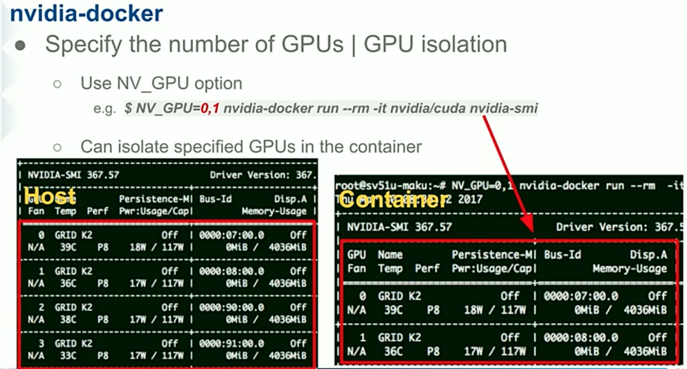
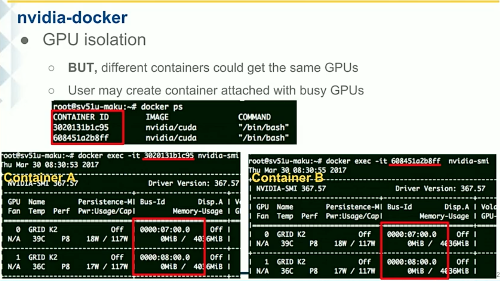
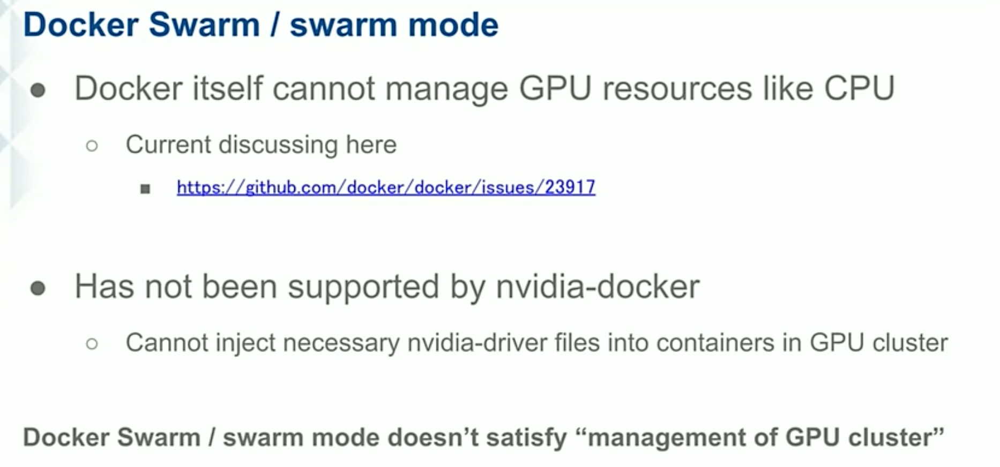
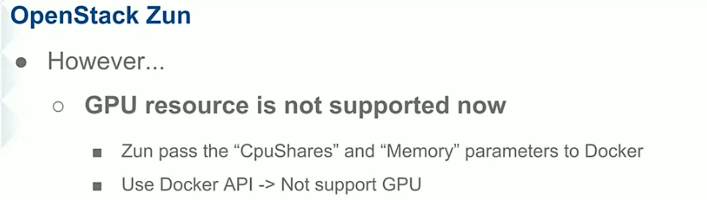
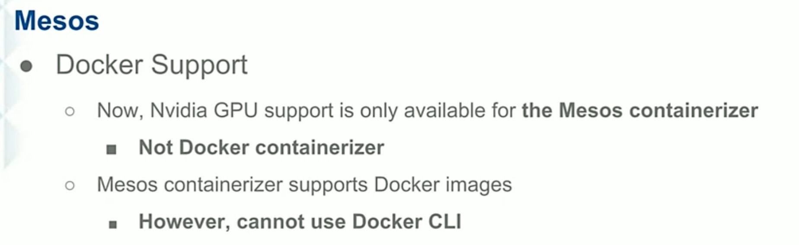
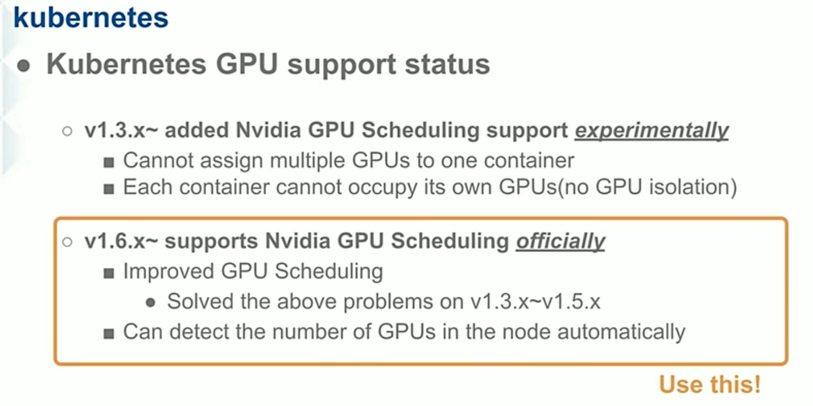
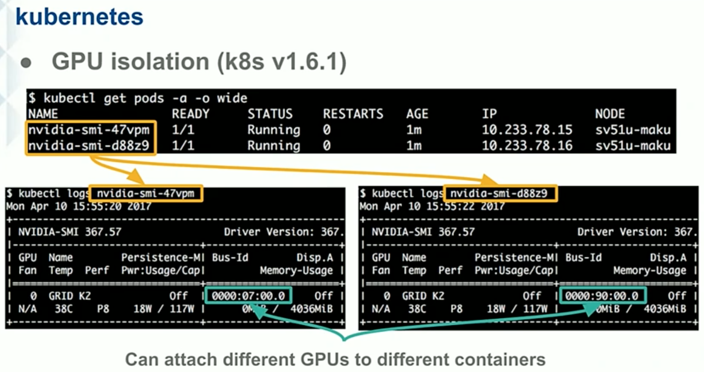

## GPU Container As A Service

#### GPU Container as a Service
* 발표 : NTT Communication
* 주제
  * GPU 컨테이너를 제공하기 위해 Docker Swarm / Mesos / k8s 기반으로 테스트를 진행하였으며,
  * 최종적으로 k8s 를 선택하여 PoC 를 진행한 결과를 공유
  * GPU 는 nvidia 를 사용하였으며, nvidia-driver 를 host 에 설치하여 테스트를 진행함

#### nvidia-driver 
* Create Container

* Isolation 

#### docker swarm

#### Zun

#### Mesos

#### k8s

* Isolation

#### Comparison Result

